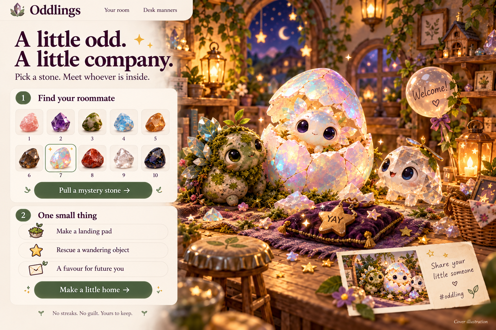

# Oddlings

[Play Oddlings](https://forgewrld711.github.io/oddlings-hackyard4/) · [Submission draft](SUBMISSION.md) · [Release checks](QA.md)

Cover selected by Miranda, regenerated October 6, 2026 with the built-in image generator using her October 1 concept image as an edit reference. The revised artwork depicts the current mystery pull, hatch, chore, furnishing, gift and postcard features; the old reminder, collection and subscription panels were removed. This is promotional illustration, not a product screenshot or the playable creature sprites. The pre-kickoff original is preserved as `dist/oddling-cover.png`. A regenerated derivative does not automatically resolve event eligibility: disclose the earlier reference and confirm the event's asset rules before submission.

A tiny roommate, not another obligation. Browser-local gamification: choose a stone, hatch a fictional companion, do a real non-food chore, explicitly self-report completion, furnish its room.

Entry code started October 5, 2026 after the Hackyard Yard 4 kickoff. No production code was copied from earlier concept work. CSS crystal sketches are temporary original UI illustrations; Caelum's final art is pending.

## Run

With Node 22 or newer, run `npm start` and open `http://127.0.0.1:43125/`. Or serve `dist/` using any static HTTP server. No dependency install, build, account, AI key, or payment needed. Tests: `npm test` (or `node --test test/*.test.mjs`).

## Boundaries

- Ten variants share one engine. Authored dialogue, not live AI or actual feelings.
- Browser persistence under `oddlings:v1`; not encrypted or cloud-synced. No sensitive data needed.
- Chore confirmation is self-reported. Demo room is separate and never saved over real progress.
- Gifts are unconditional; seven distinct visit dates, not consecutive days. No food/health scoring, punishment or revocation.
- Reduced-motion and quiet controls, keyboard hatch/light/task paths. No audio.
- Share postcard: locally drawn 1200×900 PNG, default anonymous pet name, explicit nickname opt-in, copyable #oddling caption. No task text, dates, reminders or desktop capture; no automatic posting. Demo exports are visibly labeled.
- Browser habitat, not a native desktop overlay. No email or medical integration, payments, or background alarms.
- External Google Fonts is the sole presentation request; system font fallback works without it.

## Event checklist

Kickoff email verified October 5: Speedrun cutoff October 7 at 2 p.m. EDT; final deadline October 9 at 2 p.m. EDT. Target Wednesday noon. Submission needs an open-source repo, demo video, writeup, and screenshot. Private preview hosting is not the Hackyard submission.

Public source and playable hosting are live. Remaining: human-sided actual chore demo, cover-reference eligibility check, and final submission receipt. Detailed creature portraits are a future visual upgrade; the current playable creatures are CSS illustrations.
